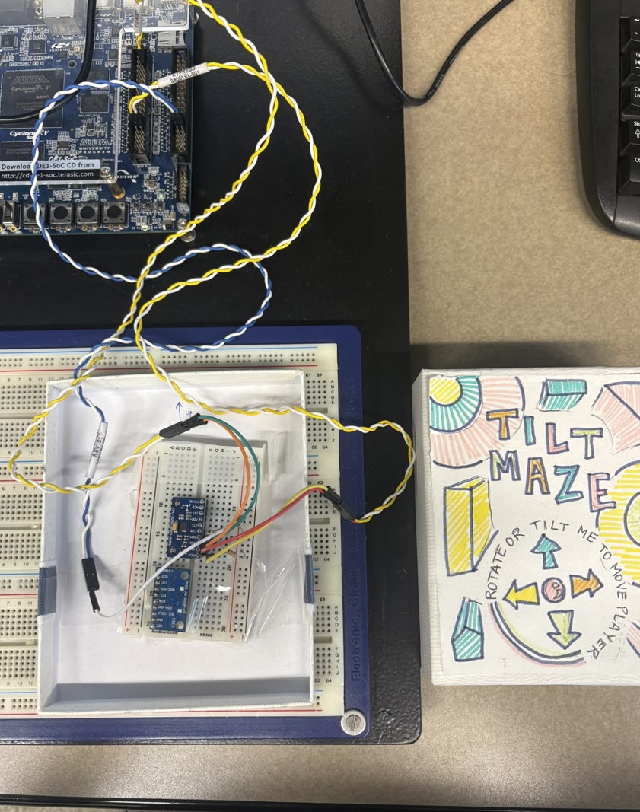
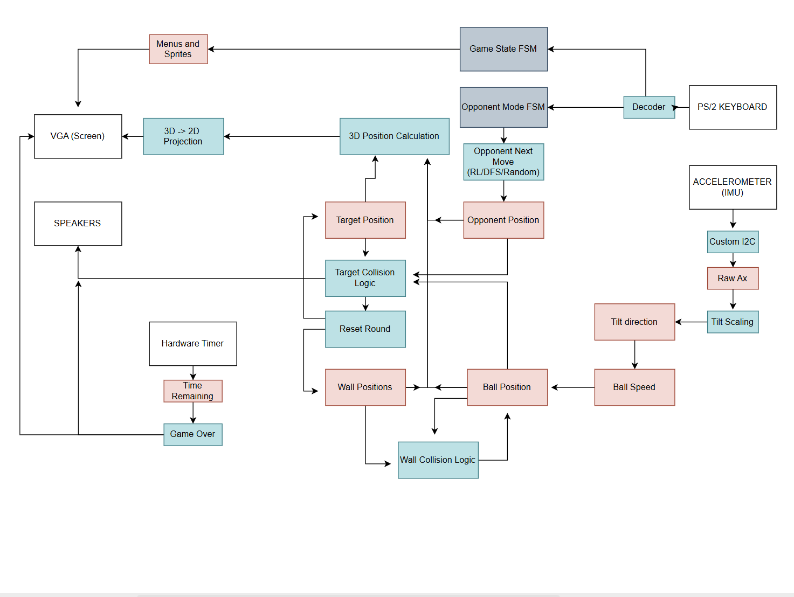

full_project_folder contains all files necessary for compilation. It is the actual project.

code_archive contains snippets of random code and alternate versions of various functions and features.

List of files in full_project_folder:

(Descriptions TBA)

